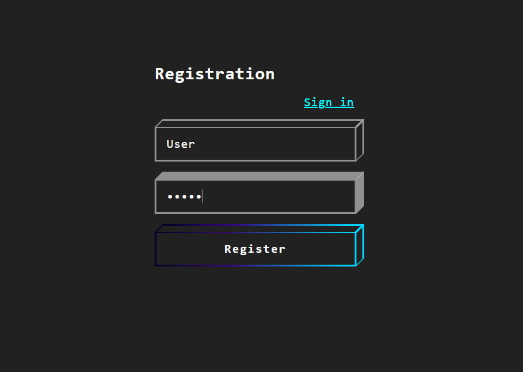
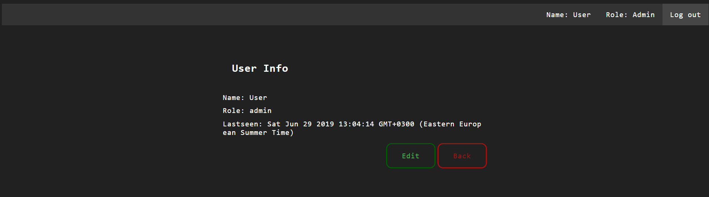
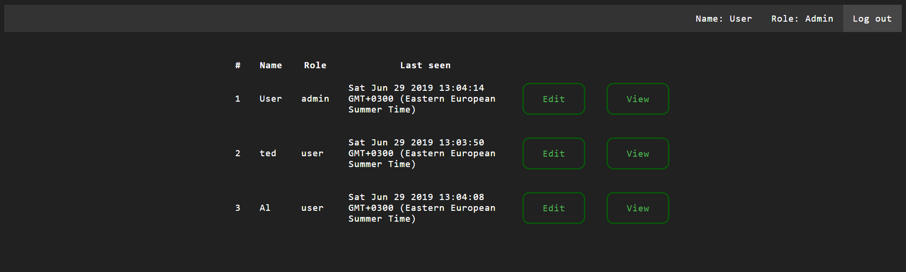
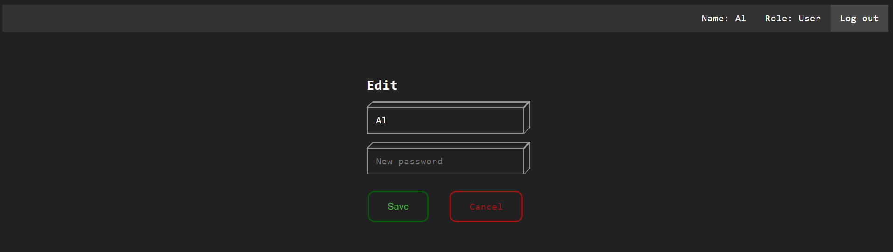
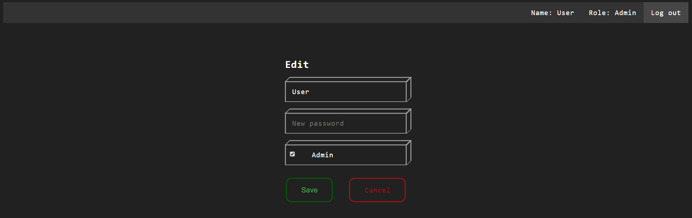

#Node.js Authorization with JWT and Cookies
===

This is the test application shows how to work with JWT(json web token) using cookies.
I use `bcrypt.js` for encrypt/decrypt user's password. All information write on the MongoDB using `mongoose.js`. All html pages generated with *ejs* templates.

1. **Registration/Authorization**

2. **User view**
(if user haven't any privileges, he/she will see this screen)

3. **Admin view**
(if user is an admin, he/she has an access to all users in system)

4. **User edit**
(here user can change his nickname and password)

5. **Admin edit**
(seeing as admin has access to all users, he/she also can take or deprive a privilege)

